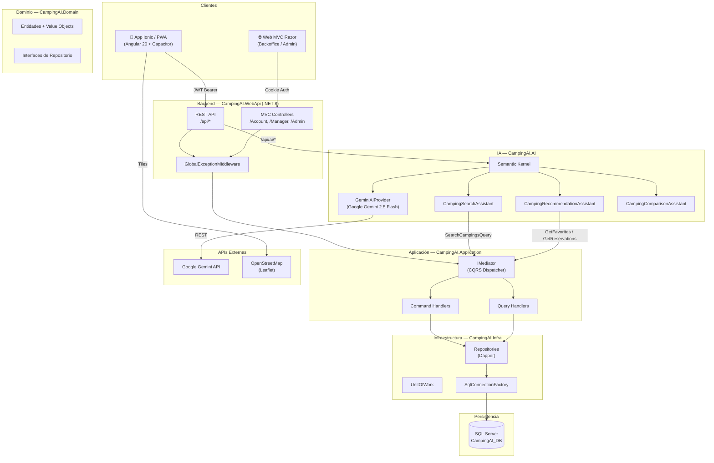
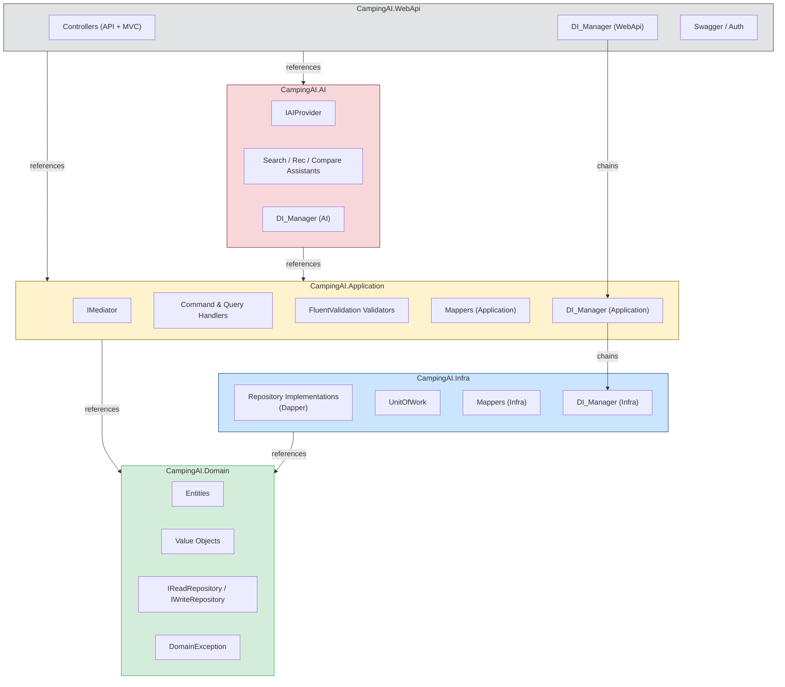
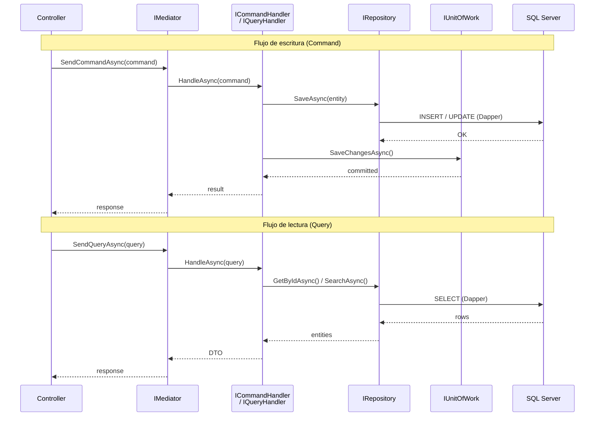
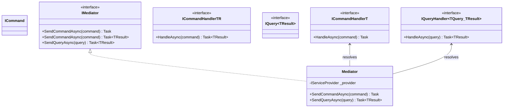
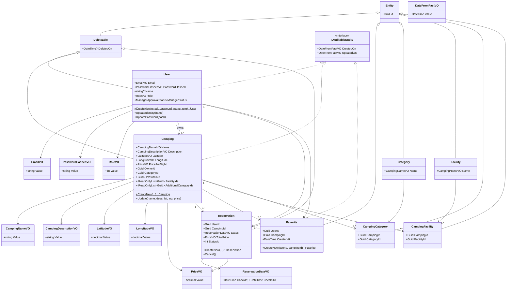
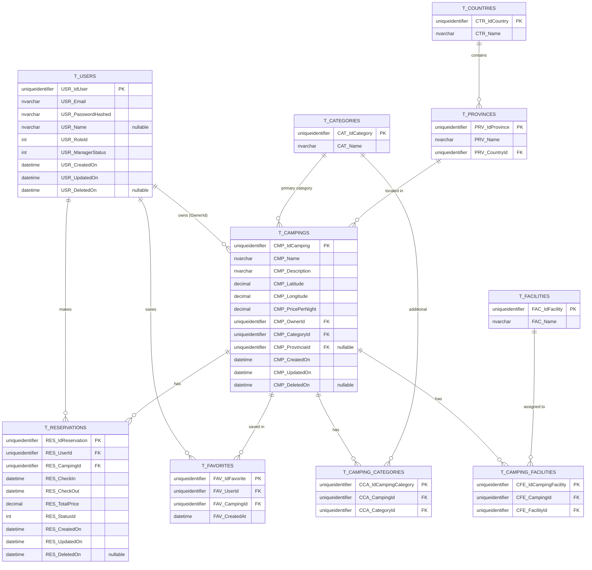
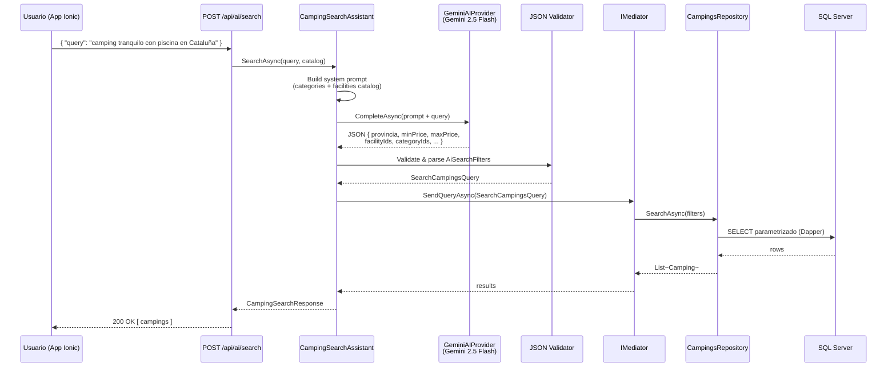
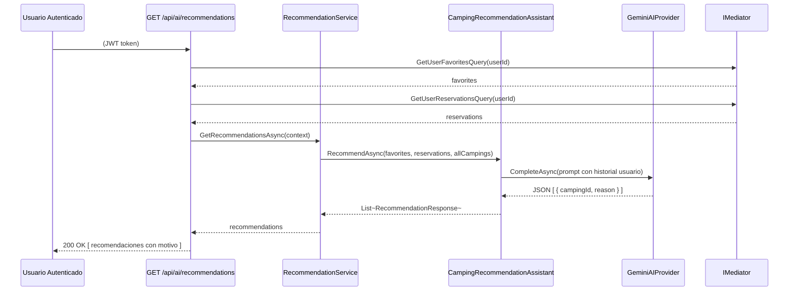
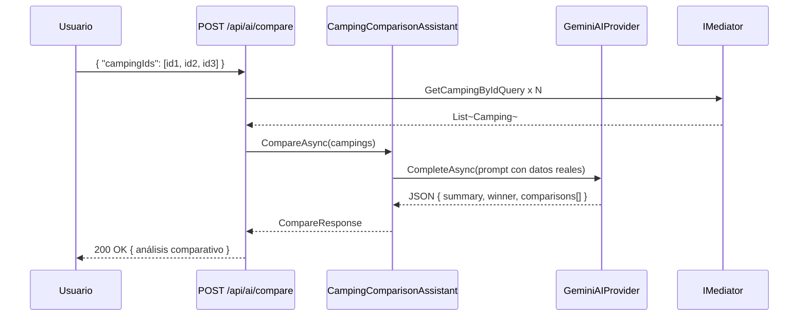
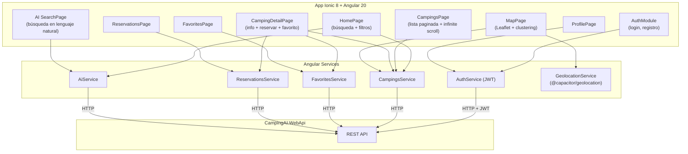

# CampingAI — Diagramas de Arquitectura

> Diagramas generados en formato **Mermaid**. Se pueden exportar a imagen con extensiones como *Mermaid Preview* (VS Code) o [mermaid.live](https://mermaid.live).

---

## 1. Arquitectura General

---

## 2. Clean Architecture — Capas y Dependencias

---

## 3. CQRS — Commands, Queries y Mediator

---

## 4. Modelo de Dominio — Entidades y Value Objects

---

## 5. Modelo de Base de Datos — Tablas y Relaciones

---

## 6. Flujo IA — Lenguaje Natural → Filtros → Resultados

### Módulo 1: Búsqueda Inteligente

### Módulo 2: Recomendaciones Personalizadas

### Módulo 3: Comparador Inteligente

---

## 7. Diagrama de Componentes — App Móvil (Ionic)

